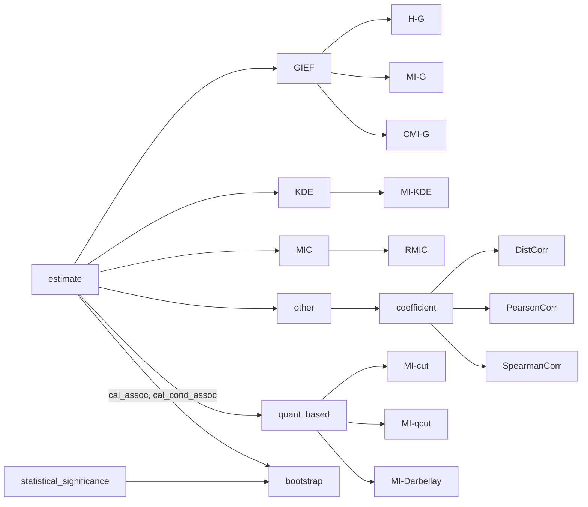

### general-information-estimation-framework（通用数据信息估计框架）


### 项目用途

用于计算任意两个或多个一元或多元、连续或离散变量之间的相关、关联以及其他更高阶的数据信息关系

### 项目结构

```
|-- general-information-estimation-framework
    |-- estimate            # 各类基于K近邻、KDE、离散化、MIC和模型等的相关、关联和数据信息估计算法
        |-- __init__.py     # 默认顶层方法
        |-- setting.py      # NOTE, 设置: 变量类型为离散"d"和连续"c"; 信息估计的对数底数为e
        |-- util.py         # 通用工具: 数据标准化、离散化、K近邻查询、球体积计算
        |-- _univar_encoding.py     # 一维变量编码
        |-- gief            # 创新点, 不同类型变量通用数据信息估计: 边际熵、条件熵、互信息、条件互信息
            __init__.py
            |-- entropy     # 条件熵和边际熵
                |-- __init__.py
                |-- cond_entropy.py
                |-- marg_entropy.py
            |-- mutual_info     # 互信息
                |-- __init__.py
                |-- _kraskov.py # 基于Kraskov的K近邻信息估计
                |-- _ross.py    # 基于Ross的K近邻信息估计
                |-- mi.py       # 互信息估计
                |-- cmi.py      # 条件互信息估计

    |-- statistical_significance
        |-- bootstrap       # 基于等量有放回自举的关联度量

```


