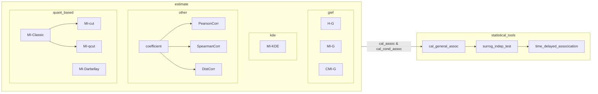

### general-information-estimation-framework

### TODOs

1. ~~script/独立性检验/statistical_power_test.py~~
2. ~~scipt/时延关联检测/main.py中背景值较高, 与代用数据计算结果不吻合~~
3. statistital_significance/surrog_indep_test.py中通过随机抽样获得关联值分布
4. 继续estimate中mic及剩下的部分封装测试

### Project Purpose

This project aims for:
1. computing higher-order information interactions between different types (discrete & continuous) of variables
2. uncovering complex associations and causal relationships in high-dimensional data

### Project Structure

```
|-- general-information-estimation-framework
    |-- estimate            # information estimation base on KNN, KDE, etc.
        |-- __init__.py     
        |-- setting.py      # NOTE var types: "d" for discrete and "c" for continuous
        |-- util.py
        |-- _univar_encoding.py     # encoding one-dimensional variable data
        |-- gief            # general information estimation
            __init__.py
            |-- entropy     # marginal and conditional entropies
                |-- __init__.py
                |-- cond_entropy.py
                |-- marg_entropy.py
            |-- mutual_info
                |-- __init__.py
                |-- _kraskov.py # KNN estimation proposed by Kraskov et al.
                |-- _ross.py    # proposed by Ross
                |-- mi.py       # mutual information estimation
                |-- cmi.py      # conditional mutual information estimation

    |-- statistical_tools
        |-- (deprecated) bootstrap_coeff.py     # association measure based on bootstrap test
        |-- surrog_indep_test.py                # association measure and independence test based on surrogate data
        |-- time_delayed_association.py         # time delayed association detection

    |-- script
        |-- 独立性检验
            |-- indep_test.py               # independence test
            |-- statistical_power_test.py   # statistical power test
        |-- 条件独立性检验
            |-- cond_indep_test.py          # conditional independence test
        |-- 时延关联检测

```

file dependency plot：



### References

1. A. Kraskov, H. Stoegbauer, P. Grassberger: Estimating Mutual Information. Physical Review E, 2003.
2. D. Lombardi, S. Pant: A Non-Parametric K-Nearest Neighbor Entropy Estimator. Physical Review E, 2015.
3. B. C. Ross: Mutual Information between Discrete and Continuous Data Sets. PLoS One, 2014.
4. https://github.com/dizcza/entropy-estimators
5. https://github.com/danielhomola/mifs

