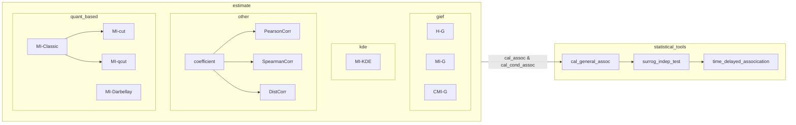

### general-information-estimation-framework (GIEF)

### Package Info

https://pypi.org/search/?q=giefstat

### Notes

1. <font color="red">根据FGD测试结果, 离散变量可被stdize_values处理后视为连续变量, 代入MI-GIEF中进行计算</font>
2. <font color="red">stdize_values在对连续变量处理过程时加入了噪音并归一化</font>

### Project Purpose

This project aims to lay a basis for:
1. computing higher-order information interactions between different types (discrete & continuous) of variables
2. uncovering complex associations and causal relationships in high-dimensional data

### Project Structure

```
    |-- giefstat
    |   |-- __init__.py
    |   |-- setting.py          # 项目设置
    |   |-- util.py             # 通用工具
    |   |
    |   |-- estimate            # 基于KNN和KDE等方法的数据信息计算和关联估计方法
    |   |   |-- __init__.py
    |   |   |
    |   |   |-- correlation_coeff   # 常见相关系数
    |   |   |   |-- __init__.py
    |   |   |   |-- coefficient.py
    |   |   |
    |   |   |-- gief            # 通用信息估计
    |   |   |   |-- __init__.py
    |   |   |   |-- entropy     # 信息熵
    |   |   |   |   |-- __init__.py
    |   |   |   |   |-- cond_entropy.py  # 条件熵估计
    |   |   |   |   |-- marg_entropy.py  # 边际熵估计
    |   |   |   |-- mutual_info
    |   |   |       |-- __init__.py
    |   |   |       |-- _kraskov.py # 由Kraskov等提出的K近邻互信息估计
    |   |   |       |-- _ross.py    # 由Ross等提出的互信息估计
    |   |   |       |-- mi.py       # 互信息估计
    |   |   |       |-- cmi.py      # 条件互信息估计
    |   |   |
    |   |   |-- kde
    |   |   |   |-- __init__.py
    |   |   |   |-- kde.py  # 基于KDE的边际熵和互信息估计
    |   |   |
    |   |   |-- mic
    |   |   |   |-- __init__.py
    |   |   |   |-- _mic_rmic.py    # MIC和RMIC计算
    |   |   |   |-- mi_cmi.py       # 基于MIC和RMIC的互信息和条件互信息估计
    |   |   |   |-- rgsr.pickle     # RMIC中用于修正MIC下界的回归模型
    |   |   |
    |   |   |-- model_based
    |   |   |   |-- __init__.py
    |   |   |   |-- mi_cmi.py       # 基于机器学习预测模型的关联和条件关联系数估计
    |   |   |
    |   |   |-- quant_based
    |   |       |-- __init__.py
    |   |       |-- _quant_darbellay.py # Darbellay数据离散化方法
    |   |       |-- mi_classic.py   # 基于经典等距和等频离散化的互信息估计
    |   |       |-- mi_darbellay.py # 基于Darbellay离散化的互信息估计
    |   |   
    |   |-- statistical_tools
    |       |-- __init__.py
    |       |-- surrog_indep_test.py                # 基于代用数据的关联度量和独立性检验
    |       |-- time_delayed_association.py         # 时延关联检测
    |
    |-- script
        |-- 独立性检验
        |   |-- indep_test.py               # 独立性检验测试
        |   |-- statistical_power_test.py   # 统计效能测试
        |
        |-- 条件独立性检验
        |   |-- cond_indep_test.py          # 条件独立性检验测试
        |
        |-- 时延关联检测
            |-- four_species_test.ipynb     # 四种群时延关联检测测试
            |-- four_siso_test.ipynb        # 四SISO系统时延关联检测测试

```

file dependency plot：



### References

1. A. Kraskov, H. Stoegbauer, P. Grassberger: Estimating Mutual Information. Physical Review E, 2003.
2. D. Lombardi, S. Pant: A Non-Parametric K-Nearest Neighbor Entropy Estimator. Physical Review E, 2015.
3. B. C. Ross: Mutual Information between Discrete and Continuous Data Sets. PLoS One, 2014.
4. https://github.com/dizcza/entropy-estimators
5. https://github.com/danielhomola/mifs

### TODOs

1. ~~script/独立性检验/statistical_power_test.py~~
2. ~~scipt/时延关联检测/main.py中背景值较高, 与代用数据计算结果不吻合~~
3. statistital_significance/surrog_indep_test.py中通过随机抽样获得关联值分布
4. ~~继续estimate中mic及剩下的部分的封装测试~~
5. 一致性测试
6. 时效性测试
