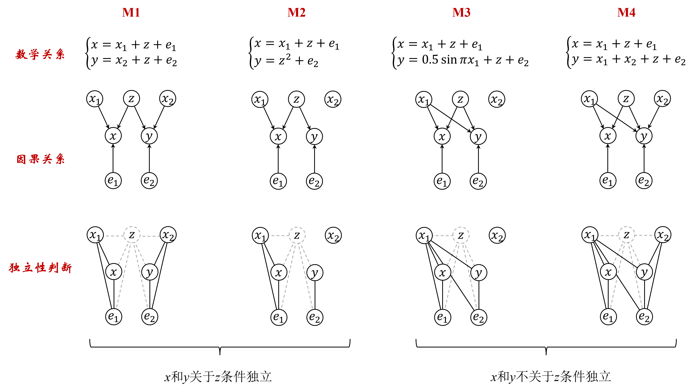
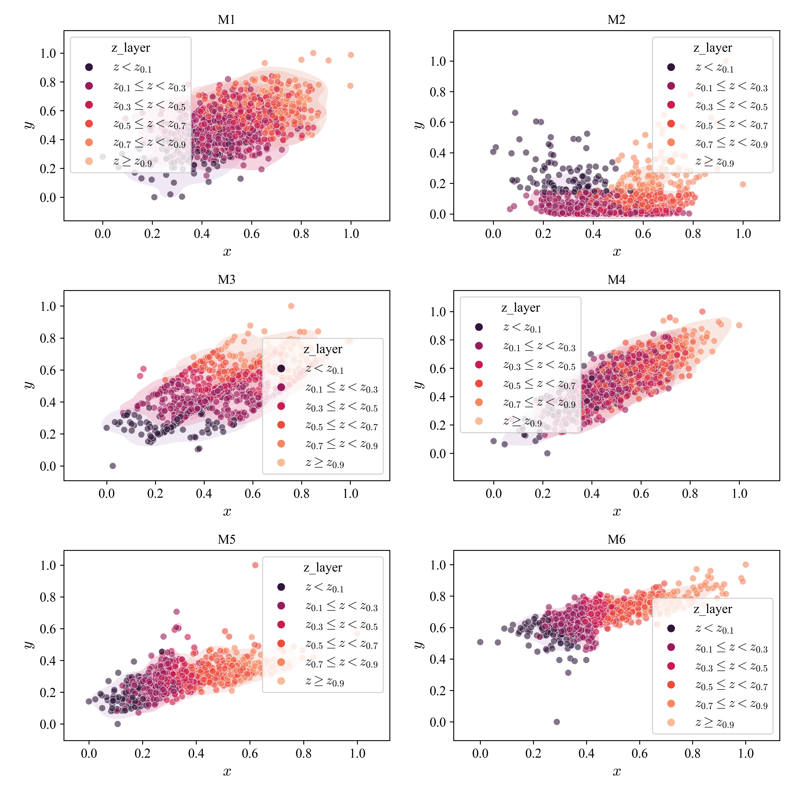
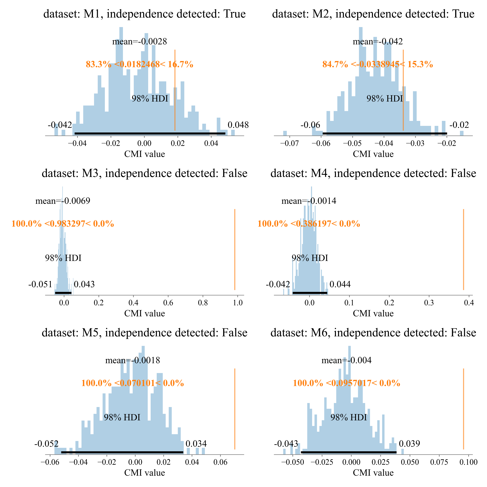

#! https://zhuanlan.zhihu.com/p/625496775
# **基于贝叶斯网络和条件互信息的独立性判断与检验**

## **一、用于测试的数据集描述**

数据集来源[^1]：

> Z. Cai, R. Li, Y. Zhang: A Distribution Free Conditional Independence Test with Applications to Causal Discovery, Journal of Machine Learning Research, 2022. 

本文在其基础上作了一些改动。

$$
\begin{aligned}
    x_1 &\sim \rm{Normal}(0, 1) \\
    x_2 &\sim \rm{Normal}(0, 1) \\
    z &\sim \rm{Normal}(0, 1)  \\
    e_1 &\sim \rm{Uniform}(0, 1e^{-6}) \\
    e_2 &\sim \rm{Uniform}(0, 1e^{-6}) \\
\end{aligned}
$$

$$
\rm{M1}: \left\{
\begin{aligned}
    x &= x_1 + z + e_1 \\
    y &= x_2 + z + e_2 \\
\end{aligned}
\right. 
$$

$$
\rm{M2}: \left\{
\begin{aligned}
    x &= x_1 + z + e_1 \\
    y &= z^2 + e_2 \\
\end{aligned}
\right.
$$

$$
\rm{M3}: \left\{
\begin{aligned}
    x &= x_1 + z + e_1 \\
    y &= 0.5 \cdot \sin(\pi \cdot x_1) + z + e_2 \\
\end{aligned}
\right.
$$

$$
\rm{M4}: \left\{
\begin{aligned}
    x &= x_1 + z + e_1 \\
    y &= x_1 + x_2 + z + e_2 \\
\end{aligned}
\right.
$$

$$
\rm{M5}: \left\{
\begin{aligned}
    x &= \sqrt{|x_1 \cdot z|} + z + e_1 \\
    y &= 0.25 \cdot x_1^2 x_2 ^ 2 + x_2 + z  + e_2 \\
\end{aligned}
\right.
$$

$$
\rm{M6}: \left\{
\begin{aligned}
    x &= \log{(|x_1 \cdot z| + 1)} + z + e_1 \\
    y &= 0.5 \cdot (x_1^2 \cdot z) + x_2 + z  + e_2 \\
\end{aligned}
\right.
$$

在数据集M1 ~ M6中，$x_1$、$x_2$、$z$、$e_1$和$e_2$为相互独立的随机因变量，而$x$和$y$为因变量非线性作用的结果。

## **二、基于贝叶斯网络的独立性判断**

根据贝叶斯网络中的**D分离原理**[^2]可对x和y关于z的条件独立性进行判断：
1. 根据上述数学关系式获得各变量间的因果关系即贝叶斯网络；
2. 对贝叶斯网络进行无向道德化处理（Moralize），并进行条件独立性判断
判断结果如图中最后一行所示。其中，M1和M2中x和y关于z条件独立，而在M3和M4中x和y不关于z条件独立。



## **三、基于条件互信息的计算验证**

准备工作

```python
import seaborn as sns
import pandas as pd
import arviz as az
import numpy as np
import sys
import os

BASE_DIR = os.path.abspath(os.path.join(os.getcwd(), "../" * 2))
sys.path.insert(0, BASE_DIR)

from setting import plt
from statistical_significance.surrog_indep_test import exec_surrog_indep_test


def _normalize(x: np.ndarray):
    x = x.copy()
    x_min, x_max = np.min(x), np.max(x)
    return (x - x_min) / (x_max - x_min)


def gen_data(func: str, N: int):
    """产生数据"""
    x1 = np.random.normal(0, 1, N)
    x2 = np.random.normal(0, 1, N)
    e1 = np.random.random(N) * 1e-6
    e2 = np.random.random(N) * 1e-6
    z = np.random.normal(0, 1, N)
    
    if func == "M1":
        x = x1 + z + e1
        y = x2 + z + e2
    elif func == "M2":
        x = x1 + z + e1
        y = np.power(z, 2) + e2
    elif func == "M3":
        x = x1 + z + e1
        y = 0.5 * np.sin(x1 * np.pi) + z + e2
    elif func == "M4":
        x = x1 + z + e1
        y = x1 + x2 + z + e2
    elif func == "M5":
        x = np.sqrt(np.abs(x1 * z)) + z + e1
        y = 0.25 * (x1 ** 2) * (x2 ** 2) + x2 + z + e2
    elif func == "M6":
        x = np.log(np.abs(x1 * z) + 1) + z + e1
        y = 0.5 * (x1 ** 2 * z) + x2 + z + e2
    else:
        raise ValueError(f"unknown func {func}")
    
    return _normalize(x), _normalize(y), _normalize(z)
```

首先，对以上四个数据集中样本进行可视化。  
在每张子图中，使用不同颜色表示位于不同 $z$ 分位数层级 $l_{z,i}$ 中的 $x$、$y$ 样本点。比如黑色散点表示在层 $l_{x, 0}$ 即 $z$ 小于其0.1分位数 $z_{0.1}$ 时 $x$ 和 $y$ 的分布。  
可以结合以上因果分析验证
* 在M1和M2各分位数层级 $l_{z,i} (0 \leq i \leq 5)$ 中，$p(x,y|z \in l_{z, i})=p(x|z \in l_{z, i}) \cdot p(y|z \in l_{z, i})$，即 $(x \perp y|z)$；
* 在M3至M6各分位数层级 $l_{z,i} (0 \leq i \leq 5)$ 中，$p(x,y|z \in l_{z, i})\neq p(x|z \in l_{z, i}) \cdot p(y|z \in l_{z, i})$，即 $(x \not\perp y|z)$。

```python
funcs = ["M1", "M2", "M3", "M4", "M5", "M6"]
N = 1000
colors = ["blue", "orange", "green", "red", "grey", "cyan", "black", "purple"]
legends = [
    r"$z < z_{0.1}$",
    r"$z_{0.1} \leq z < z_{0.3}$", r"$z_{0.1} \leq z < z_{0.3}$",
    r"$z_{0.3} \leq z < z_{0.5}$", r"$z_{0.5} \leq z < z_{0.7}$",
    r"$z_{0.7} \leq z < z_{0.9}$", r"$z \geq z_{0.9}$"]

_, axs = plt.subplots(3, 2, figsize=(10, 10))
for i, func in enumerate(funcs):
    x, y, z = gen_data(func, N)
    data = pd.DataFrame(np.c_[x, y, z], columns=["x", "y", "z"])
    
    qs = np.quantile(z, (0.1, 0.3, 0.5, 0.7, 0.9))
    
    def _deter_z_layer(z, qs):
        if z < qs[0]:
            return 0
        else:
            if z >= qs[-1]:
                return 5
            else:
                for i in range(4):
                    if (qs[i] <= z) & (z < qs[i + 1]):
                        return i + 1
    
    data["z_layer"] = data["z"].apply(lambda z: legends[_deter_z_layer(z, qs)])
    
    ax = axs[i // 2, i % 2]
    ax.set_title(func)
    sns.kdeplot(
        x="x", y="y", data=data, hue="z_layer", hue_order=legends, shade=True, levels=5,
        palette="rocket", alpha=0.3, gridsize=50, common_grid=False, ax=ax, zorder=-1)
    sns.scatterplot(
        x="x", y="y", data=data, hue="z_layer", hue_order=legends, ax=ax, zorder=1, alpha=0.6,
        palette="rocket", marker="o", sizes=10)
    
    ax.set_xlabel("$x$")
    ax.set_ylabel("$y$")
plt.tight_layout()
```



接下来，采用基于代用数据（Surrogate Data）和条件互信息(Conditional Mutual Information, CMI)的独立性检验算法对以上四个数据集中 $x$ 和 $y$ 关于 $z$ 的条件独立性进行计算判断：

```python
method = "CMI-GIEF"
rounds = 300
alpha = 0.01

_, axs = plt.subplots(3, 2, figsize=(10, 10))
for i, func in enumerate(funcs):
    x, y, z = gen_data(func, N)
    assoc, (p, indep, assocs_srg) = exec_surrog_indep_test(
        x, y, method, z=z, xtype="c", ytype="c", ztype="c", rounds=rounds, alpha=alpha)

    # 画图
    ax = axs[i // 2, i % 2]
    az.plot_posterior(
        {f"{method}_Surrog": assocs_srg}, 
        kind="hist",
        bins=50,
        ref_val=assoc,
        hdi_prob=1 - alpha * 2,
        ax=ax)
    ax.set_title(f"dataset: {func}, independence detected: {indep}", fontsize=18)
    ax.set_xlabel("CMI value")
plt.tight_layout()
```



每张子图中蓝色直方图显示了基于代用数据获得的对应条件独立时的CMI-GIEF值背景分布，黄色竖线则表示实际样本所得的条件互信息值。其他参数说明请见arviz文档[^3]  
如果黄色竖线位于黑色横线所标记的区间中，则表示实际样本中  $x$ 和 $y$ 关于 $z$ 条件独立；否则，$x$ 和 $y$ 不关于 $z$ 条件独立。  
可以看出，基于代用数据的CMI-GIEF认为M1和M2中的 $x$ 和 $y$ 关于 $z$ 条件独立，而在M3至M6中的数据则不满足条件独立。该结论与上述基于贝叶斯网络的判断结果一致。
* 注意，HDI (High Density Interval)是贝叶斯分析中的概念，这里仅利用其对CMI值的分布和显著性区间进行展示

## **参考材料**

[^1] https://www.jmlr.org/papers/volume23/20-682/20-682.pdf
[^2] https://sites.stat.washington.edu/mmp/courses/535/fall11/Handouts/l4-bayes-net-decomp.pdf  
[^3] https://python.arviz.org/en/stable/